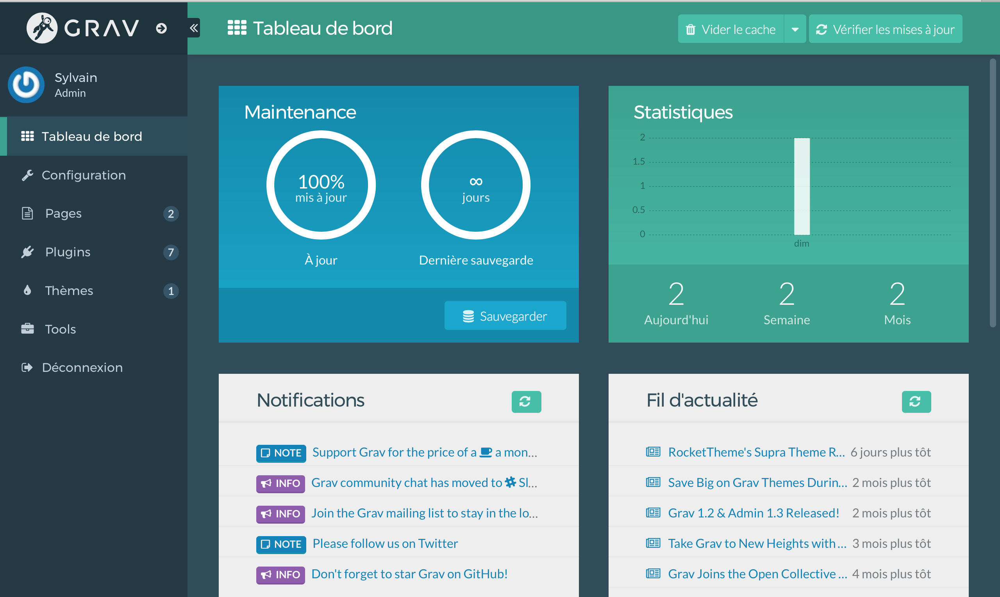

Le **panneau d'adminitration de GRAV ** est une interface dynamique qui permet la gestion du site, la création de nouveaux contenus et la mise à jour de ses plugins.

Cette gestion est réalisée au moyen du plugin **Grav Administration Panel** pour Grav.
Cette interface graphique permet de configurer Grav et de créer et de modifier facilement des pages. 
Ce plugin reste totalement facultatif, et il n'est pas indispensable au fonctionnement de Grav. 

En fait, l'interface d'administration offre une vue délibérément limitée afin de s'assurer qu'elle reste facile à utiliser. Certains utilisateurs pourront par préférence travailler directement sur les fichiers de configuration.

## Fonctionnalités## 
* Connexion avec cryptage automatique de mot de passe
* Gestion du mot de passe oublié
* Gestion des utilisateurs connectés
* Mise à jour simplifiée de Grav
* Tableau de bord avec état de maintenance, activité du site et dernières mises à jour de page
* Sauvegarde sous Ajax
* Clear-cache sous Ajax
* Gestion de la configuration du système
* Gestion de la configuration du site
* Modes normal et expert qui permettent l'édition via un editeur ou YAML
* Liste de pages avec filtrage et recherche
* Création, édition, déplacement, copie et suppression de la page
* Editeur avec  mise en surbrillance da le syntaxe de code et prévisualisation instantanée
* Raccourcis clavier, barre d'outils et mode plein écran sans distraction
* Télécharger Drag-n-drop des fichiers multimédia de la page, y compris le positionnement de la glisser-déposer dans l'éditeur
* Mise à jour simplifiée du thème et des plugins
* Gestionnaire de plugins
* Gestionnaire de thème
* Installation par GPM de nouveaux plugins et thèmes
* ACL pour les administrateurs
